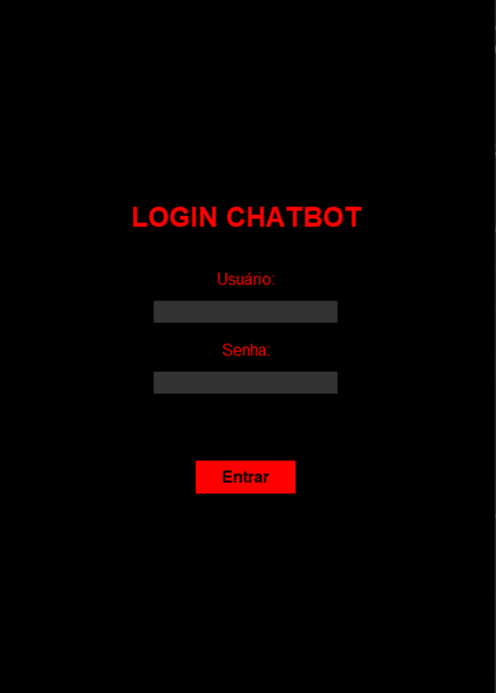
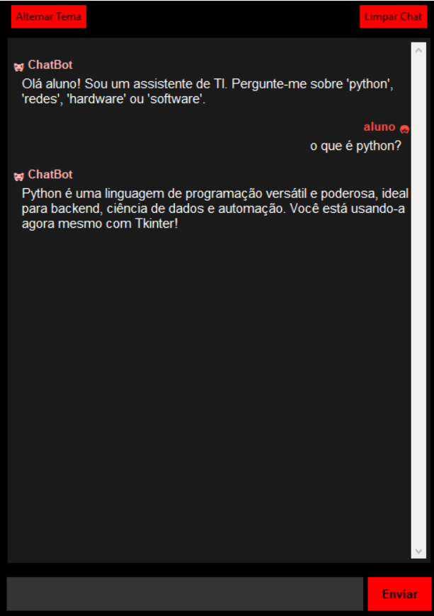

# Chatbot IA - Projeto de Curso Técnico

Este projeto foi desenvolvido como parte do Exercício de Fixação e Aprofundamento do Curso Técnico de Desenvolvimento de Sistemas (SESI/SENAI), sob a orientação dos professores Luis Felipe Cardoso e Wesley Fioreze.

O objetivo foi desenvolver uma aplicação desktop em Python que simula um chatbot inteligente, com tela de login, temas claro/escuro e uma interface gráfica profissional construída com Tkinter.

## 🖼️ Telas da Aplicação

*(Instrução: Tire prints da sua aplicação rodando e substitua os caminhos abaixo. Você pode arrastar as imagens diretamente para a interface do GitHub para fazer o upload e obter o link.)*

| Tela de Login (Tema Escuro) | Tela de Chat (Tema Claro) |
| :---: | :---: |
|  |  |

## ✨ Funcionalidades

O projeto cumpre todos os requisitos solicitados na atividade:

*   **Tela de Login Segura:**
    *   Campos para usuário e senha.
    *   Validação de credenciais pré-definidas no código (`aluno`/`12345`).
    *   Exibição de mensagem de erro para login inválido.

*   **Interface de Chat Interativa:**
    *   Caixa de texto com barra de rolagem para exibir a conversa.
    *   Campo de entrada para o usuário digitar suas mensagens.
    *   Botão **"Enviar"** para mandar a mensagem e receber uma resposta.
    *   Botão **"Limpar"** que apaga todo o histórico da conversa na tela.

*   **Tema Escuro e Claro:**
    *   Um botão **"Alternar Tema"** que modifica dinamicamente as cores de toda a aplicação entre um modo escuro (padrão) e um modo claro.

*   **Exibição de Mensagens Formatada:**
    *   As mensagens do usuário e do chatbot mostram o nome e um ícone (`🧑` para o usuário, `🤖` para o bot).
    *   Cada tipo de mensagem (usuário vs. chatbot) possui formatação distinta de cor, alinhamento e espaçamento para fácil diferenciação.

*   **IA Simulada Especialista em TI:**
    *   A IA é **simulada localmente**, sem depender de APIs externas, garantindo funcionamento offline e sem custos.
    *   As respostas são focadas em **assuntos de Tecnologia da Informação** (Python, Redes, Hardware, etc.), conforme o requisito.
    *   A resposta do chatbot é exibida com um pequeno atraso, simulando o "raciocínio".

## 💻 Tecnologias Utilizadas

*   **Linguagem:** Python 3
*   **Interface Gráfica (GUI):** Tkinter (biblioteca padrão do Python)

## 🚀 Como Executar

Para executar o projeto, siga os passos abaixo.

**1. Pré-requisitos:**

*   É necessário ter o **Python 3** instalado em sua máquina. A biblioteca **Tkinter** geralmente já vem inclusa na instalação padrão do Python.

**2. Bibliotecas para Instalar:**

*   Nenhuma biblioteca externa é necessária! O projeto utiliza apenas módulos padrão do Python.

**3. Executando a Aplicação:**

1.  Clone este repositório para a sua máquina local:
    ```bash
    git clone https://github.com/seu-usuario/seu-repositorio.git
    ```
2.  Navegue até o diretório do projeto:
    ```bash
    cd seu-repositorio
    ```
3.  Execute o script principal (substitua `nome_do_seu_arquivo.py` pelo nome real do seu arquivo):
    ```bash
    python nome_do_seu_arquivo.py
    ```